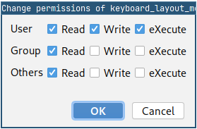

# FilePermissionsPlugin

<!-- Plugin description -->
**File Permissions Plugin** is provides a simple plugin to change file permissions directly from IntelliJ.

It adds two actions:

- **Change Permissions** to change the permissions by showing a dialog
- **Make File Executable** by making the file executable by its owner (that's probably the one you want)

<!-- Plugin description end -->

## Not published yet!

The plugin is not published yet, waiting for Jetbrains moderation. But you can build it yourself or use 
the released version from github.

## Installation

- Using IDE built-in plugin system:
  
  <kbd>Settings/Preferences</kbd> > <kbd>Plugins</kbd> > <kbd>Marketplace</kbd> > <kbd>Search for "FilePermissionsPlugin"</kbd> >
  <kbd>Install Plugin</kbd>
  
- Manually:

  Download the [latest release](https://github.com/bjonnh/FilePermissionsPlugin/releases/latest) and install it manually using
  <kbd>Settings/Preferences</kbd> > <kbd>Plugins</kbd> > <kbd>⚙️</kbd> > <kbd>Install plugin from disk...</kbd>

---
Plugin based on the [IntelliJ Platform Plugin Template][template].

[template]: https://github.com/JetBrains/intellij-platform-plugin-template
